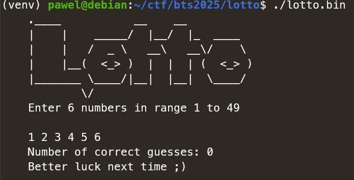
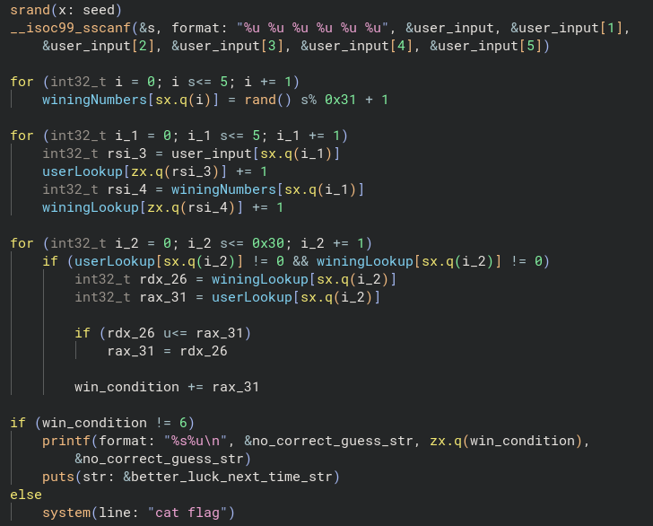

# Lotto (pwn)

We're given a binary, which lets us input 6 numbers.
We're supposed to guess what 6 numbers program generated internally.

Load it up to decompiler and clean up the code...

Our 6 numbers gets processed by scanf, then program chooses 6 random numbers using `rand()` with initialized `seed`
by a call to `getrandom()`. Flag gets printed if we got all 6 numbers correct.

This actually gives us weird write-what-where, where we can increment any value in memory by setting up `user_input`
correctly in `userLookup[user_input[i]]` in second loop, but this leads nowhere.
