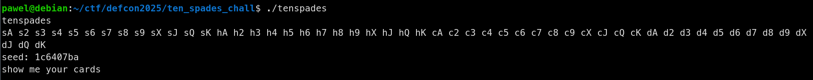
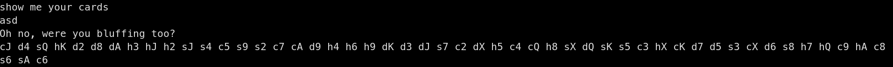
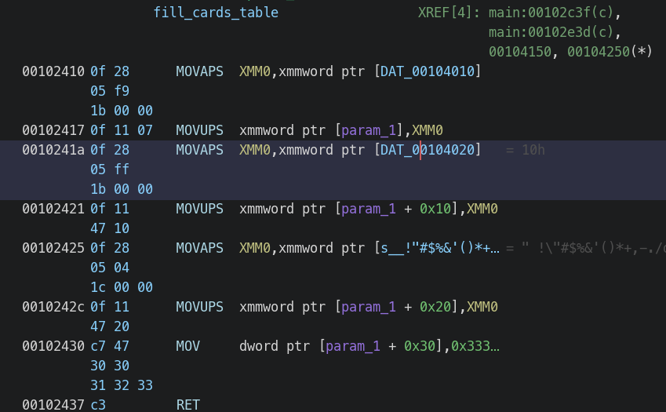
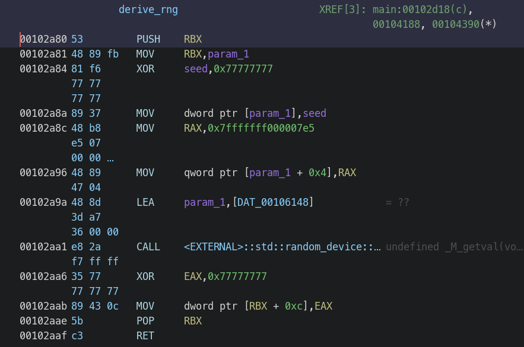
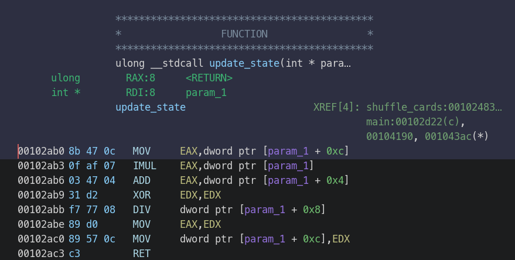
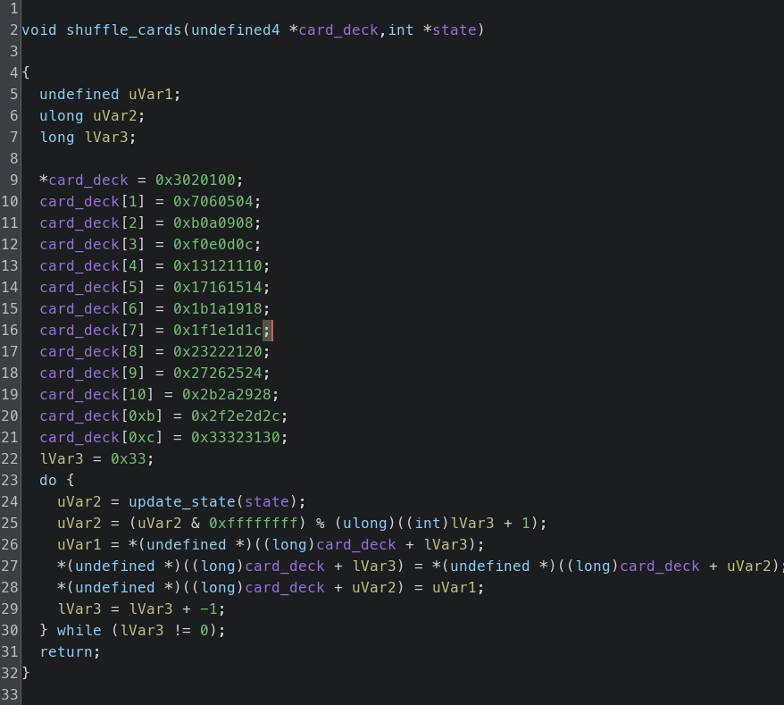
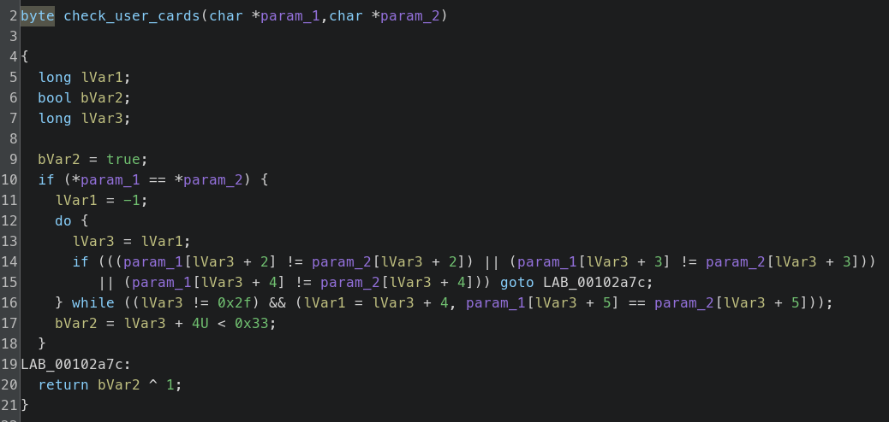
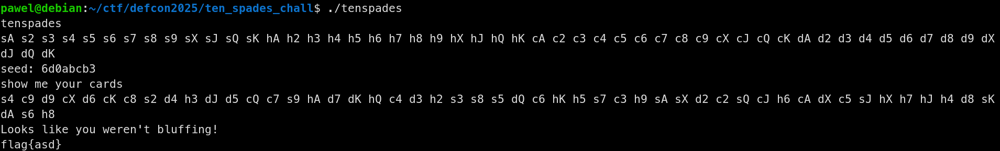

# Ten spades

We're given a binary that prints unshuffled deck of cards and a seed value.



The binary interprets our input as a card deck in the same format. It outputs next random card deck on wrong input



Let's inspect the binary in ghidra. There are couple of functions that we need to understand.

First one is card deck initialization.



Which really just writes byte values from 0 to 51 to first 52 bytes of the parameter. Because there are 52
cards in a deck, these values are enum values representing each card in a deck.

Next function initializes 128-bit seeded random state used to shuffle cards. The default seed value is 1337.



`param1` is a 128-bit state. We can see that if seed is 1337, every dword of `param1` is computed deterministically,
but the last dword which is [totally random](https://en.cppreference.com/w/cpp/numeric/random/random_device/operator())
32-bit value xored by `0x77777777`. Luckily for us, this 32-bit value is provided by the program at the start.

Next function updates the state.



It does one write at the end to the last dword of the state. it is equivalent to
```
# STATE[i] - i-th 32-bit value of the state
STATE[3] = mask_u32(STATE[0] * STATE[3] + STATE[1]) % STATE[2]
return STATE[3]
```

Just 2 more functions. Next one is `shuffle_cards` which uses initialized prng to shuffle the start deck. 



It starts from the last index and swaps a random card with the current one. It is known as [Fisher-Yates](https://en.wikipedia.org/wiki/Fisher%E2%80%93Yates_shuffle) algorithm. It uses update_state which we analyzed earlier.

Last function is user input check, which checks if the provided deck is the same as the shuffled one.



With that knowledge we can write a script that generates the deck given the 32-bit random last element of the state.
Generator code is in `solve.py`. It outputs the input for the program.


